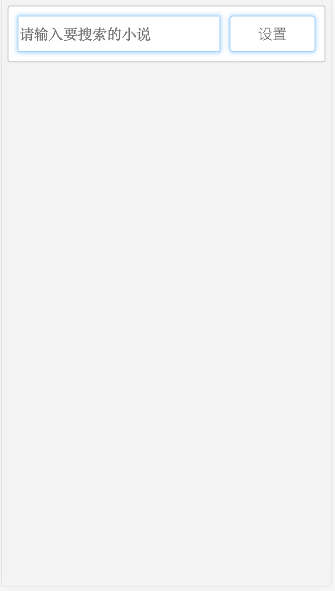
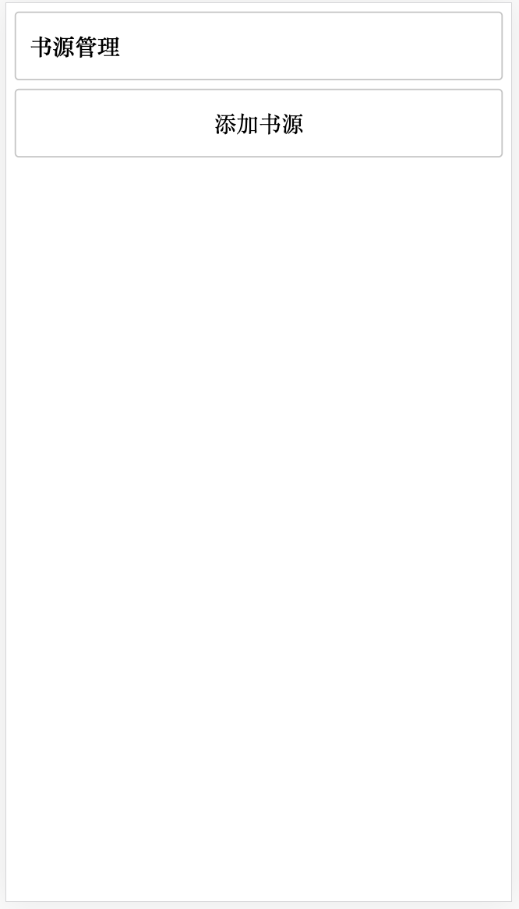
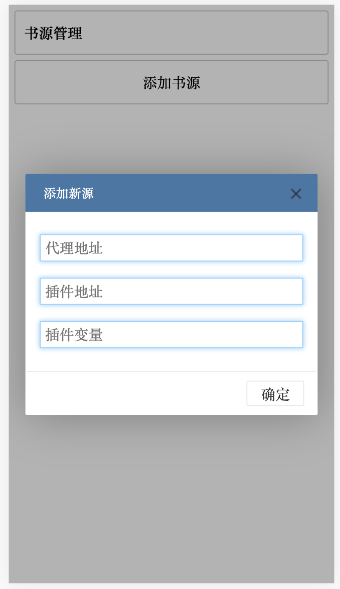
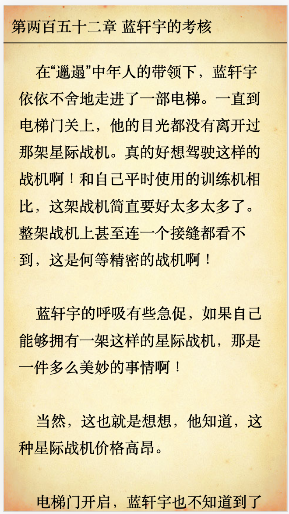
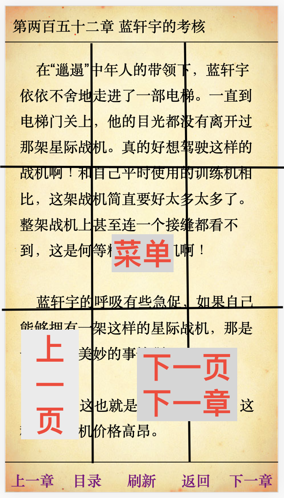

# 使用说明

[TOC]

最后有使用说明

## 开发书源

### 开发说明

#### API 接口

1. API.GetData

  > ```javascript
  > /** GET 请求
  >  * url 请求网址
  >  * callback 成功回调
  >  * err 出错回调
  >  */
  > API.GetData=function (url, callback, err){}
  > ```

1. API.PutData

  > ```javascript
  > /** POST 请求
  >  * url 请求网址
  >  * data 请求数据
  >  * callback 成功回调
  >  * err 出错回调
  >  */
  > API.PutData=function (url, data, callback, err){}
  > ```

1. API.PutJson

  > ```javascript
  > /** POST 发送 JSON 请求
  >  * url 请求网址
  >  * data 请求数据
  >  * callback 成功回调
  >  * err 出错回调
  >  */
  > API.PutJson=function (url, data, callback, err){}
  > ```

1. API.GBKencodeURI

  > ```javascript
  > /** GBK URL 转义
  >  * str 待转吗
  >  */
  > API.GBKencodeURI=function (str){}
  > ```


#### 扩展接口

1. `String.prototype.format`

   可使用占位符字符替换，举个🌰：

   ```javascript
   "{{data}}".format({data:"数据"})
   ```

   ```javascript
   "{{0}}{{1}}".format("数据1","数据2")
   ```
   
2. `String.prototype.toDate`

   可以将日期型字符串快速转换为日期对象，举个🌰：

   ```javascript
   "2019-04-01 12:12:12".toDate()
   ```

3. `Date.prototype.format`

   可以将日期转换为指定格式日期型字符串，举个🌰：

   ```javascript
   (new Date().format("yyyy-MM-dd hh:mm:ss")
   ```

   ```javascript
   (new Date().format("yyyy-MM+8-dd hh:mm:s")
   ```

4. `Date.prototype.Add`
  举个🌰：见：  `Date.prototype.format` 🌰
  
#### 书源对象

##### 书源解析条件判定：
>
> 1. 首字为 `$` 为获取节点数组
> 1. `$$` 数组下标
> 1. `@` 表示 `attribute`
> 1. `@Text` 表示 `innerText`
> 1. `@HTML` 表示 `innerHtml`
> 1. `type` 1 文本 2 图片、文本 3 视频
>

##### 以下是必须属性，用于基本操作
1. `Name` 名字
1. `Model` 书源标志
1. `url` 书源地址
1. `ProxyUrl` 书源代理
1. `isGBK` 是否是`GBK`编码
1. `search` 搜索解析

    > 1. `url` 搜索地址，关键字替换为`{{keyword}}`
    > 1. `IsPost` 是否是`POST`请求
    > 1. `Data` `POST`请求传入的数据，`JSON`字符串格式，关键字替换为`{{keyword}}`
    > 1. `selector` 列表选择器
    > 1. `data` 结果解析条件
    >
    >> 1. `url` 书地址
    >> 1. `title` 书标题
    >> 1. `author` 作者
    >> 1. `time` 更新时间
    >> 1. `state` 状态
    >> 1. `image` 图片
  
1. `catalog` 搜索解析

    > 1. `url` 书目地址 书网址关键字为`{{url}}`
    > 1. `IsPost` 是否是`POST`请求
    > 1. `Data` `POST`请求传入的数据，`JSON`字符串格式，关键字替换为`{{keyword}}`
    > 1. `selector` 列表选择器
    > 1. `screen` 筛选关键字
    > 1. `screenSelector` 筛选选择器
    > 1. `data` 结果解析条件
    >
    >> 1. `url` 目录标题
    >> 1. `title` 书标题
  
1. `content` 搜索解析

    > 1. `url` 搜索地址，关键字替换为`{{keyword}}`
    > 1. `IsPost` 是否是`POST`请求
    > 1. `Data` `POST`请求传入的数据，`JSON`字符串格式，关键字替换为`{{keyword}}`
    > 1. `selector` 列表选择器
    > 1. `data` 结果解析条件
    > 1. `type` 类型
  
1. `update` 搜索解析

    > 1. `url` 搜索地址，关键字替换为`{{keyword}}`
    > 1. `IsPost` 是否是`POST`请求
    > 1. `Data` `POST`请求传入的数据，`JSON`字符串格式，关键字替换为`{{keyword}}`
    > 1. `selector` 列表选择器
    > 1. `data` 结果解析条件
    >
    >> 1. `time` 更新时间
    >> 1. `state` 状态
    >> 1. `image` 图片
  
  

### 举个例子🌰

```javascript 1.8
{
    Name: "幻月书院",
    Model: "m.huanyue123.com",
    url: "http://m.huanyue123.com",
    ProxyUrl: "http://127.0.0.1/ProxyCrossDomain/",
    isGBK: false,
    search: {
        url: "http://m.huanyue123.com/s.php",
        IsPost: true,
        selector: "$.hot_sale",
        Data: JSON.stringify({keyword: "{{keyword}}"}),
        data: {
            url: "a@href",
            title: ".title@Text",
            author: "$.author$$1@Text",
            time: "",
            state: "$.author$$0@Text",
            image: "",
        }
    },
    catalog: {
        url: "http://m.huanyue123.com/{{url}}/all.html",
        selector: "$#chapterlist > p a",
        screen: "直达页面底部",
        screenSelector: "@Text",
        data: {
            url: "@href",
            title: "@Text",
        }
    },
    content: {
        url: "http://m.huanyue123.com/{{url}}",
        selector: "#chaptercontent",
        data: "@innerHtml",
        type: 1
    },
    update: {
        url: "http://m.huanyue123.com/{{url}}",
        selector: ".synopsisArea_detail",
        data: {
            time: "$p$$3@Text",
            state: "p.upchapter@Text",
            image: "img@src",
        }
    },
},
```


## 功能介绍

1. 默认界面

  

1. 添加书源

  
  
  
  

1. 搜索，使用

  
  
  
  

